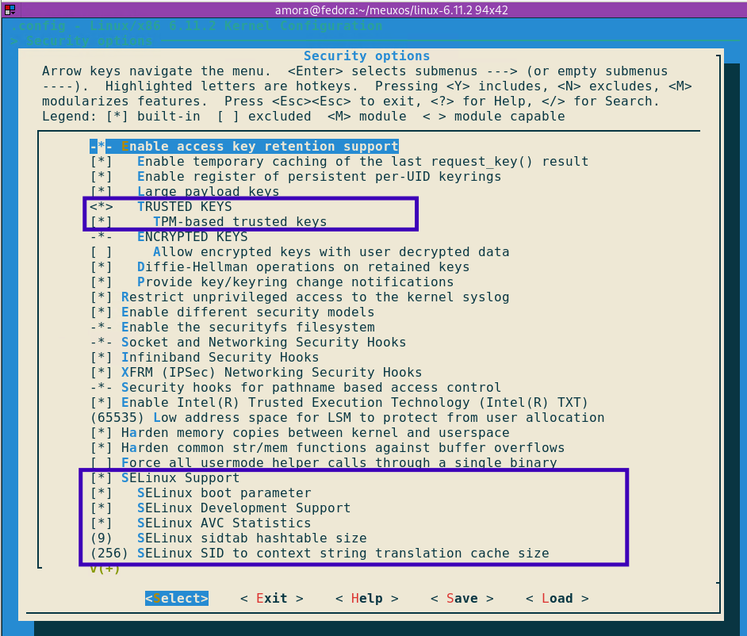

# linux-os-builder

In this guide, I will walk you through the steps to compile the Linux kernel from source on a Fedora machine. Compiling the kernel gives you the flexibility to customize it for your needs.

## Prerequisites

Before we start compiling, you need to have a few tools installed. I will be using Fedora.

### 1. Install Build Tools

These tools include compilers and utilities needed to build the kernel:

- **GCC** (C compiler)
- **G++** (C++ compiler)
- **Make** (Automation tool for builds)
- **Autoconf, Automake, Libtool** (Tools for building software)
- **pkg-config** (Helps manage library dependencies)

To install all the required tools, run this command in the terminal:

`sudo dnf install @development-tools, ncurses-devel`

This will install all the necessary development tools in one go.

_Note:_ _I will be using Fedora, you can use any Linux distro, However, some of the commands will be different._
# Configure the kernel

### Step 1: Download the Kernel

First, you need to download the latest Linux kernel. We'll be using the official website for this.

- Go to [kernel.org](https://kernel.org) and download the latest stable kernel version.
- For convenience, I’ll use the terminal to download it directly. To do so, run the following command in the terminal:

	`wget https://cdn.kernel.org/pub/linux/kernel/v6.x/linux-6.11.2.tar.xz`
	
- Make sure to download the latest stable version available on the website. This guide will be using the latest release at this time which is version `6.11.2`

### Step 2: Organize the Files

Now that you’ve downloaded the kernel, let’s organize the files structure.

1. **Create a new directory** in your home folder where we will keep everything. I will name my directory `meuxos` (since I will be calling my distro `meuzxos`):

```
cd ~
mkdir meuxos && cd meuxos
```

2. **Move the downloaded kernel file** into the newly created directory. You can check if it’s there by running `ls`:
    
You should see the `linux-6.11.2.tar.xz` file in the list. Mine looks like the following:
> 

### Step 3: Extract the Kernel

Once the kernel file is in place, it's time to extract it. We’ll use the `tar` command to do this, run the following command in the terminal:

`tar -xvf linux-6.11.2.tar.xz > tar_vrfy.log`

- This will extract the kernel and redirect the file verification log to `tar_vrfy.log`. It’s a good idea to keep this log in case there are any issues during extraction.
- After the extraction process is completed, our directory structure will look like the following:
> 

### Step 4: Configure our Kernel

Once the extraction is done, it's time to start the configuration process. This is a critical step where will be deciding the following:

- 

Now lets navigate into the kernel directory, to do so execute the following command:

`cd linux-6.11.2/`

Once we are in the main source directory its time to start the configuration process. To begin the configuration process, we’ll use the `make menuconfig` command. This will open up a text-based user interface for configuring the kernel. so lets run the following command:

`make menuconfig`

Once you execute this, you’ll be greeted with a terminal-based configuration menu that looks something like this:
> 

I know, it seems overwhelming just to look at it, but trust me, it's not that complicated. Here’s a breakdown of what you need to know and what we will be focus on: 

**Navigating the Menu**

- Use the arrow keys to move up and down.
- Use `Enter` to select a category or option.
- Press `Esc` to go back to the previous menu.
- Press `Space` to enable or disable options
	- you’ll see a `[*]` - enable or `[ ]` - disable next to the option.

while there are may section, the following are the once we will be focusing on:

1. **General Setup:** This is where we configure basic kernel settings.

> 
> This is what the `General Setup` terminal window looks like.

From the `General Setup` we need to enable the following:

- [ ] First, lets enable [initrd - Initial RAM Disk](https://docs.kernel.org/admin-guide/initrd.html), this is what allows to boot the OS by loading drivers and modules before the root filesystem is mounted. So it is critical to enable this feature.
> 
> Make sure all the fields inside the blue rectangle are **enabled** ([\*] is enabled)


- [ ] Next, I want my kernel to have a default hostname `meuxos`. So, to do so find the `Default hostname` sub-menu, it should say (none), select it and add any name you want. 
> 
> It should look something like this.

We are done at General Setup, Now go back to main menu.

2. **Processor Type and Feature:** This is where we will configure processor specific settings.

> 
> It looks something like this.

Here we will configure the following settings:

- [ ] Make sure that support for x86 architecture is enabled.
> 

Once done go back to main menu page.

3. **Device Driver:** This is where select which hardware drivers will be prebuild with our kernel. This is one of the most important section.

> 
> This is what the `Device Driver` page looks like.

We will be enabling the following settings:

- [ ] Lets enable storage driver, make sure support for NVMe, PCI and SCISI is enabled:
> 
> It should look similar to the one above.

- [ ] Next, enable `Network device Support`
> 


- [ ] Now, go to `Graphics support` and enable `Frame buffer Device`
> 
> It should look like the one above.


- [ ] After that, go to `USB support` and make sure that it is enabled. It should be by default.


- [ ] Finally, lets configure support for file system. For this project I want my kernel to support `ext4`, `btrfs`, and `xfs` to be supported.
> 
> 
> 
> Make sure the above three filesystems are enabled.

- [ ] (Optional) We can enable one last feature and that is `Security options`, for advance security. Here, make sure the support for `TPM` is enabled, without it we won't be able to encrypt our volume and won't be able to read or decrypt external I/O devices such as the one encrypted by `Windows Bitlocker`.
> 
> I am not a big fan of `SELinux`, but for the sake of security I am going to leave it enabled.

_**Note**:_ Before we exit the configuration make sure to to `Save` the configuration otherwise the changes you made will be lost. 
> 
> Now we can exit the configuration.
 
That's all for this Step. 

### Step 5: Compile our Kernel

Now that we successfully configured our kernel, its time to star the compilation process. Make sure to use as many core/processor as possible as this process will require compute power.

Use the following command to start the process:

`make -j $(nproc) > build_time.log`

- `-j $(nproc)`: use all the available cores
- If you want to use only specific cores for the process, pass the number of core you want to use to `-j` flag. _example_ make -j 3

**Compilation Result**

I compile it using virtual machine with 6 core, the time it will take to complete will be different depending on your machine. For my case it took around 15 Minute.
> 
>our kernel image file is located under `./arch/x86_64/boot/bzImage`

| Time Type | Duration   |
| --------- | ---------- |
| **Real**  | 15m31.887s |
| **User**  | 72m45.560s |
| **Sys**   | 7m45.769s  |

Congratulations 🎉 you have now successfully compiled your first Linux kernel.

### Step 6: Compile GNU Coreutils for our Kernel

The Last step before building our iso file is to add a userland for our kernel. For this we have two choice and these are:
- **GNU Coreutils** Comprehensive and popular choice among various Linux distros.
- **BusyBox** Lightweight, common on IoT kernels.

For this project we will be using `GNU Coreutils`, the latest release version is `9.5`.

- Lets download the `coreutils` file from official GNU website. Again I will be using this from the terminal: `wget https://ftp.gnu.org/gnu/coreutils/coreutils-9.5.tar.xz`
- Now, lets extract it using: `tar -xf coreutils-9.5.tar.xz`
- Make sure to navigate to the new extracted directory: `cd coreutils-9.5`
- Configure `coreutils` for our kernel name: 

```
mkdir ~/meuxos/meuxos-root
./configure --prefix=/home/<username>/meuxos/meuxos-root --disable-nls
```

Now lets compile the utility to generate a root file system for us:

`make -j $(nproc)`

Finally, lets install the `coreutils` to our custom root directory

`make install`

Once the above command completed without any error, our root file system is ready.
> 
> You should have similar output as above.
> The /bin directory contain essential binary files such as `ls`, `cd`, `mkdir`, etc.. The full utilities lists included in GNU Coreutils can be found [here](https://en.wikipedia.org/wiki/List_of_GNU_Core_Utilities_commands).

### Step 7: Build ISO File for our Kernel

The first step of building the `.iso` file is to create the full root directory. Lets head to our custom root directory and create all the directory required by Linux. 

```
cd ./meuxos-root
mkdir {dev,etc,home,lib,mnt,opt,proc,root,run,sbin,sys,tmp,usr,var,boot}
```

Our file system should look like the following:
> 
> 

Now, lets copy our kernel image to the boot directory

```
cp ../linux-6.11.2/arch/x86_64/boot/bzImage ./boot/
```

Verify that you have the image file inside `./boot`
> 


In addition to the kernel image we need two files inside the boot directory. These are: 
- `grub.cfg` this will tell the bootloader how to load our kernel. it will provide us with boot menu like the one below:
> 

- `initramfs.cpio` this will act as a temporary root filesystem before the real root filesystem is mounted.

Now, create a a file called `grub.cfg` under `./boot/grub` and past the following:

```
set default=0
set timeout=5

menuentry 'meuxos' --class os {
    insmod gzio
    insmod part_msdos
    linux /boot/bzImage
    initrd /boot/initramfs.cpio.gz
}
```
> `set default=0` this will set the default boot entry to the first one in the menu (in our case to our os which is the only one in the boot entry.
> 
> `set timeout=5` GRUB will wait 5 seconds before automatically booting the default entry.
> 
> `menuentry 'meuzos'` define a boot menu entry named meuzos.
> `insmod gzio` load the gzip decompression module. We included this module because our `initramfs` file is in `.gz` format we needed to handle .gz decompressed during boot.
> 
> `insmod part_msdos` load the `msdos` partition handling module (useful for MBR partitioning).
> 
> `linux /boot/bzImage` specify the compressed kernel image (bzImage) to load.
> 
> `initrd /boot/initramfs.cpio.gz` specify the compressed initramfs file to load.

For the initramfs.cpio.gz file I will have another blog describing how to create a minimal root file system using `busybox`. But for now you can get the file from the resource section of this blog or from my github account.

Once you get the initramfs.cpio.gz file put it inside the boot directory:
> 

One Last thing missing is the `init` file. Go to our custom os root file system and create a file called `/init` and past the following:

```
#!/bin/sh
mount -t devtmpfs none /dev
mount -t proc none /proc
mount -t sysfs none /sys

echo "Welcome to Meux Linux!"

exec /bin/sh
```

Before we build the iso file, let's try it using `qemu`

```
qemu-system-x86_64 --kernel ./boot/bzImage --initrd ./boot/initramfs.cpio.gz
```
>
>as you can see the file system is mounted and our os is working.

Finally, lets build the .iso, to do this run the following command:

```
grub2-mkrescue -o ../meuxos.iso . ./boot/bzImage
```

Once the iso file for our os is build, now lets use it to create a virtual machine, I will be using VirtualBox to try it.
>
>


